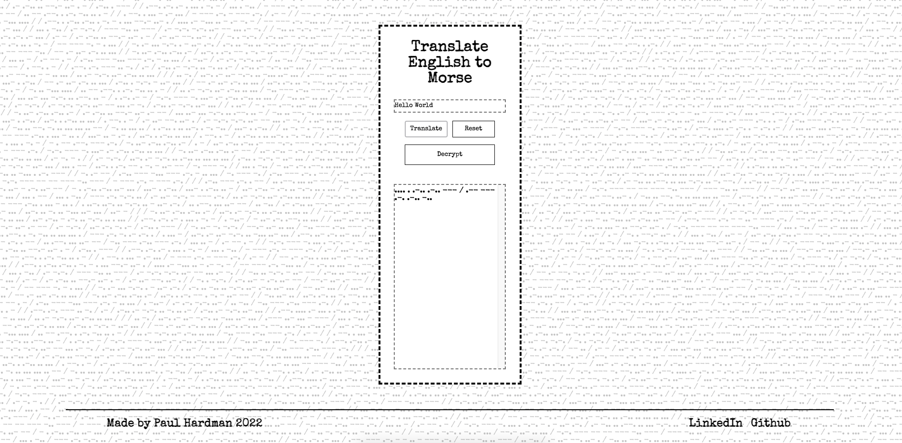

# Morse Code Translator
## 

Check it out: https://singapaul.github.io/TDD-MorseCodeTranslator/

A calculator built using HTML, SASS and Javascript. This project was my first introduction to implementing JS on a web app. E2E testing was added to the project and was facilitated with the use of Cypress.

📝  To do: 

-Clean up notation in CSS with BEM
-Add Javascript to make typewriter effect
-Add further jest testing to output
